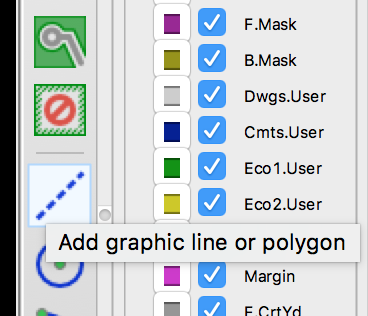
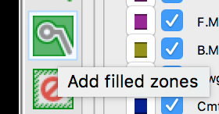
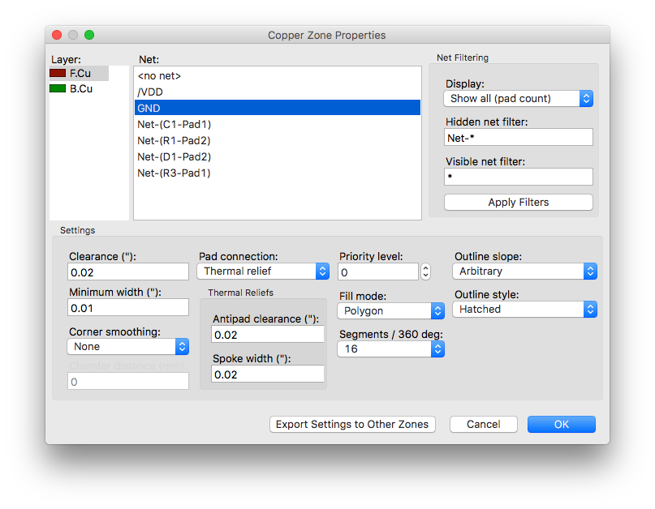
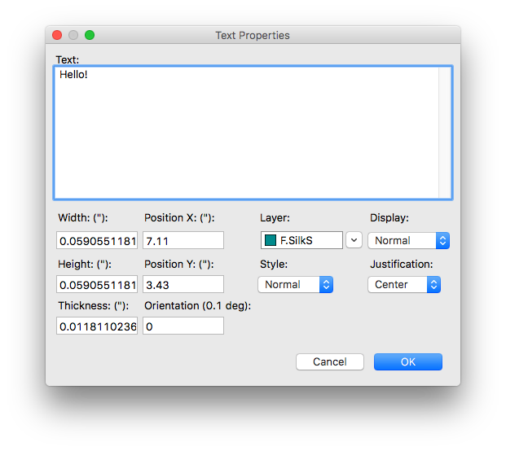

# Create PCB Layout

## Things to do

1. Generate PCB layout
1. Check design rules
1. Add tracks and vias
1. Fill zones
1. Connecting vias
1. Creating Silk Screen

## 1. Generate PCB

1. Open PCBNew from [Schematic viewer](schematic.md)

    
1. Generate PCB

    

    
1. Select footprint mode

    
1. Spread out all footprints

    
1. Press `m` to move components
1. Press `f` to flip to the backside of the PCB
1. Right click to select bigger grid

    
1. Press `space` to set the `(0,0)` point on the PCB

    
1. Change to edge cuts layer

    
1. Select graphic line tool

    

## 2. Check design rules

1. Check design rules

    
    
    
1. Ensure track and via sizes

    

## 3. Add tracks and vias

1. Add track by choosing the upper copper layer

    
1. Choose `Add tracks and vias`

    

## 4. Fill zones

1. Click `fill zones`

    
1. Click and add **front copper fill**

    
1. OR Click and add **back copper fill**

    
1. Right click to `Fill or Refill zones`

    

## 5. Connecting via

1. Click `v` to drop a via
1. Double click to finish
1. Hit `b` to redraw

## 6. Creating Silk Screen

1. Choose silk screen layer

    
1. Choose Text editing

    
1. Add in text manually

    
