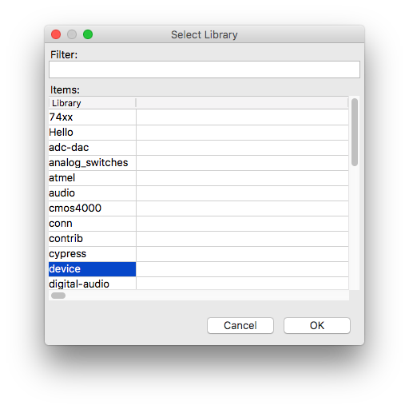
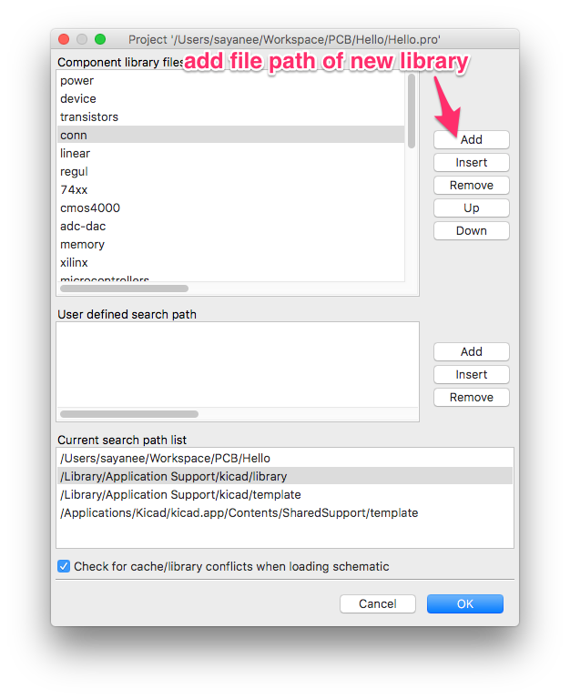
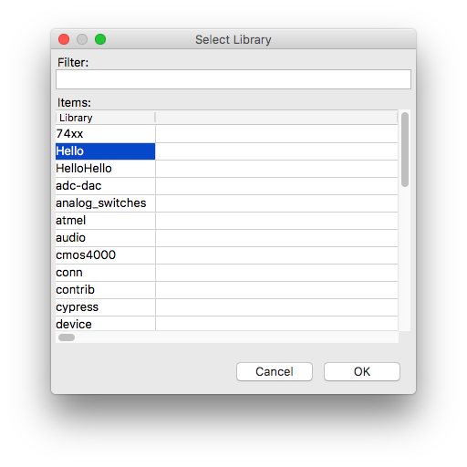

## Create library

1. Click `Schematic library editor`

  
- Click `Select working library` in the menu bar

  
- Select `device` in the list of libraries. Click `OK`.

  
- Click `load component to edit from the current library`

  
- Select a simple unpolarised capacitor as the first component of the library

  
- Create new library

  
- Save new library as `{NAME}.lib` in the project folder
- Add new library to the list `Preferences > Component Libraries`

  
  
- Click `Select working library` in the menu bar to choose the newly created library

  
  
- Ensure the new library name and filepath can be seen in the status bar above

  
