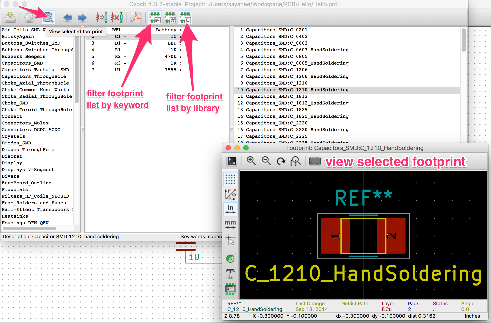

# Create schematic

## Things to do

1. Add components
- Add wires
- Add labels
- Add power
- Edit values of components
- Annotate schematic
- Perform electrical rules check
- Generate net list
- Associate component with footprint
- Generate PCB layout

## Editing schematic

1. Open schematic editor

  
- Press `a` to `add component`

  
- Press `w` to add wires for joining components

  
- Press `l` to add labels

  
- Press `p` to add power

  
- Press `v` to edit values of components

  
- Click `annotate` to annotate the schematic
- Choose the annotation options

  
- Click `Perform electrical rules checks`

  
- Add options for electrical checks

  
- Click `generate net list` in the menu

  
- Save net list in the project folder as `*.net`

  
- Click `run CvPCB to associate components and footprint`

  
- Associate each component with footprint

  
- Re-generate the net list
- Layout PCB

  
- Read netlist in layout PCB

  
- Generate PCB

  

  
