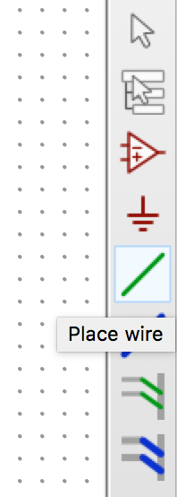
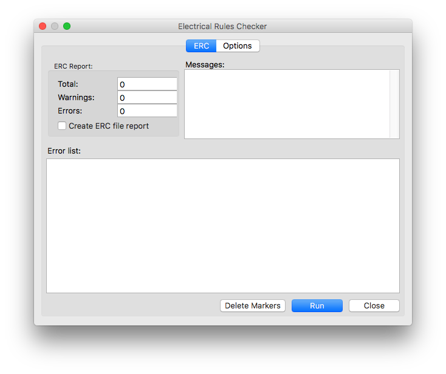
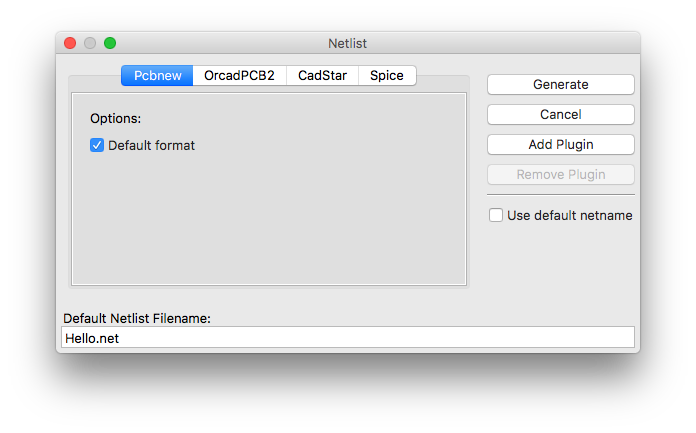
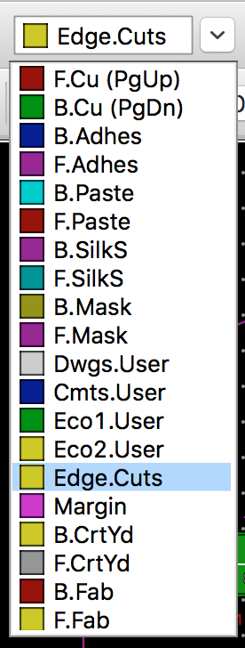
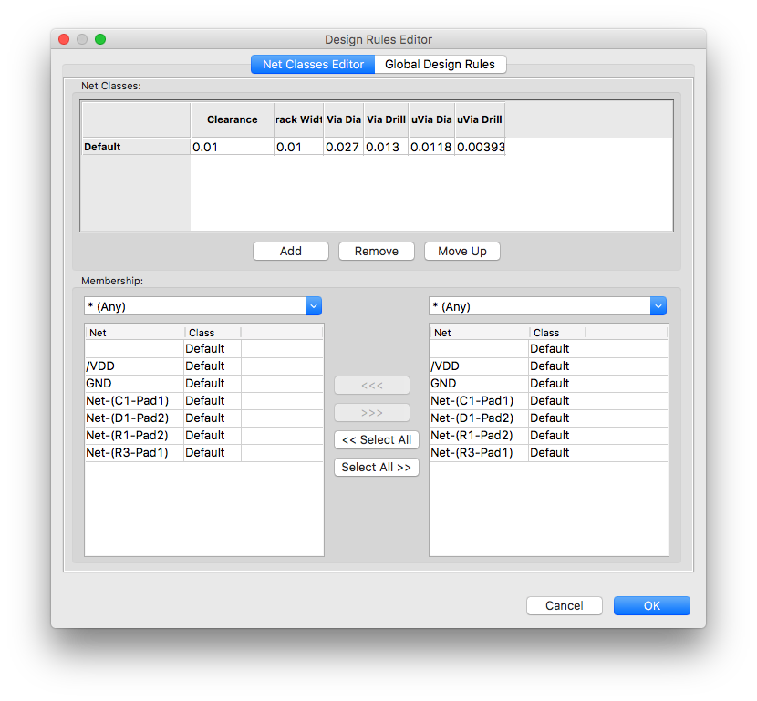
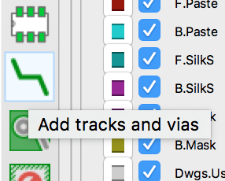

# Create schematic

## Things to do

1. Add components, wires, labels, power, edit components
1. Annotate schematic
1. Perform electrical rules check
1. Generate net list
1. Associate component with footprint
1. Generate PCB layout
1. Check design rules
1. Fill zones
1. Connecting vias
1. Creating Silk Screen

## Editing schematic

### 1. Add components

1. Open schematic editor

    
1. Press `a` to `add component`

    
1. Press `w` to add wires for joining components

    
1. Press `l` to add labels

    
1. Press `p` to add power

    
1. Press `v` to edit values of components

    

### 2. Annotate

1. Click `annotate` to annotate the schematic
1. Choose the annotation options

    

### 3. Perform electrical rules check

1. Click `Perform electrical rules checks`

    
1. Add options for electrical checks

    

### 4. Generate net list

1. Click `generate net list` in the menu

    
1. Save net list in the project folder as `*.net`

    

### 5. Associate component with footprint

1. Click `run CvPCB to associate components and footprint`

    
1. Associate each component with footprint

    
1. Re-generate the net list
1. Layout PCB

    
1. Read netlist in layout PCB

    

### 6. Generate PCB

1. Generate PCB

    

    
1. Select footprint mode

    
1. Spread out all footprints

    
1. Press `m` to move components
1. Press `f` to flip to the backside of the PCB
1. Right click to select bigger grid

    
1. Press `space` to set the `(0,0)` point on the PCB

    
1. Change to edge cuts layer

    
1. Select graphic line tool

    

### 7. Check design rules

1. Check design rules

    
    
    
1. Ensure track and via sizes

    

### 8. Add tracks and vias

1. Add track by choosing the upper copper layer

    
1. Choose `Add tracks and vias`

    

### 9. Fill zones

1. Click `fill zones`

    
1. Click and add **front copper fill**

    
1. OR Click and add **back copper fill**

    
1. Right click to `Fill or Refill zones`

    

### 10. Connecting via

1. Click `v` to drop a via
1. Double click to finish
1. Hit `b` to redraw

### 11. Creating Silk Screen

1. Choose silk screen layer

    
1. Choose Text editing

    
1. Add in text manually

    
